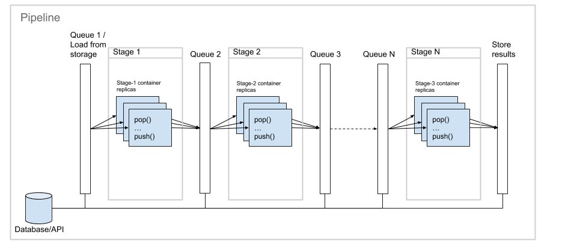

Plumber
=======

Plumber is a tool to setup scalable, language-agnostic pipelines of workers for IT automation tasks.

The task is decomposed as a series of indipendentent stages, each one formed by a set of containers that work in parallel on the same sub-task, implementing the [Pipes and Filters](https://docs.microsoft.com/en-us/azure/architecture/patterns/pipes-and-filters) pattern. The input and output of each stage is a stream of data passed via Plumber API.



The containers that make up the pipeline can be scaled independently and can be distributed across different servers, taking advantage of the elasticity that Docker Compose and Swarm provide. The data stream and storage is provided via Plumber API built upon Mongo database. 

Plumber is designed for heavy DevOps automation and is not suitable for fine graned computational tasks.

Pipeline
--------

Run `init.sh` to initialize the structure of a new pipeline in a new folder.

```
$ ./init.sh ./my-pipeline 3
```

```
$ tree -F my-pipeline/
my-pipeline/
├── stage-1/
│   ├── Dockerfile
│   └── scripts/
├── stage-2/
│   ├── Dockerfile
│   └── scripts/
├── stage-3/
│   ├── Dockerfile
│   └── scripts/
├── docker-compose.override.yml
└── docker-compose.yml
```

* `docker-compose.yml` defines the environment and shall be modified to customize the interval between executions, the initial number of replicas, and other options.
* `docker-compose.override.yml` defines the internal services such as Mongo Database and the Plumber HTTP API service, which don't usually require any change. 
* Folders `stage-1/`, `stage-2/`, and `stage-3/` contain the Docker build data for each stage. Customize the `Dockerfile` to install additional tools or libraries.
* Folders `script/` shall contain your executable scripts that are periodically executed to process the data for every stage. 

Run `docker-compose` from inside the folder to manage the pipeline.

Plumber API
-----------

The working code in the `script/` folders shall use the Plumber API to pass the data across the stage queues. So far, a Python library and a language agnostic HTTP API are provided.

### HTTP API

Endpoints can be accessed via `http://plumber/` from inside the containers network.

* **POST /<stage_number>/push**

    Push entries to a stage queue.
  
    In the body, it accepts JSON list of objects or text of lines, according to the format argument.
    
    Parameters:
     
    - format: The input format, can be json or plain. Default is json.
    - push_if_new: Push only the entries which haven't been previously pushed. Default is disabled.
    - push_if_older_than: Push only the entries which haven't been previously pushed or that have been older than a number of seconds. Default is disabled.

    It returns 200 with the number of pushed entries.
 

* **GET /<stage_number>/pop**
    
    Pop entries from a stage queue.

    Parameters:
    
    - format: The output format, can be json or plain. Default is json.
    - quantity: The number of entries to retrieve. Default is 1.

    It returns 200 with data in JSON or plain text, according to the format argument.


* **GET /<stage_number>/flush**

    Flush stage queue.

    It returns 200 empty


* **POST /<stage_number>/store**

    Store an entry to the database.

    Body: JSON object or text, according to the format argument.

    Parameters:
        
    - format: The input and output format, can be json or plain. Default is json.
    
    It Returns 200 with the ID of the stored entry.
 
* **GET /<stage_number>/load**

    Load an entry from the database.

    Parameters:
        
    - format: The input and output format, can be json or plain. Default is json.
    - filter: The filter JSON object, as accepted by Mongo find_one.
    - delete: Delete the matching objects. Default is false.
    
    It returns 200 with data in JSON or plain text, according to the format argument.
 
### Python API

Python library can be imported from inside the containers with `import plumber`.

* **async def push(stage, entry_list, push_if_new, push_if_older_than)**

    Push entries to a stage queue.

    Parameters:
        
    - stage: The number of stage queue.
    - entry_list: List of objects.
    - push_if_new: Push only the entries which haven't been previously pushed.
    - push_if_older_than: Push only the entries which haven't been previously pushed or that have been older than a number of seconds.
    
    Returns: the number of pushed entries.

* **async def pop(stage, quantity = 1)**

    Pop entries from a stage queue.

    Parameters:
        
    - stage: The number of the stage queue.
    - quantity: The number of entries to retrieve. Default is 1.
    
    Returns the data objects.

* **async def flush(stage)**

    Flush stage queue.


* **async def store(stage, json_data)**

    Store an entry to the database.

    Parameters:
        
    - stage: The number of stage queue.
    - json_data: The entry object.
    
    Returns the Mongo ObjectID of the insterted object in string format.

* **async def load(stage, filter_, delete)**

    Load an entry from the database.

    Parameters:
        
    - stage: The number of stage queue.
    - filter_: The filter JSON object, as accepted by Mongo find_one.
    - delete: Delete the matching objects.
    
    Returns: the requested entry object.

Examples
--------

* [Alexa-subdomains-capture](examples/alexa-subdomains-capture/) is a three-stage pipeline to scan the Alexa top 1K subdomains and take a screenshot of every HTTPS website found. It is written in shell script and uses HTTP API for the communications inside the pipeline.
* [Test-API](examples/test-api/) is a single-stage pipeline for API testing. It is written in Python.

